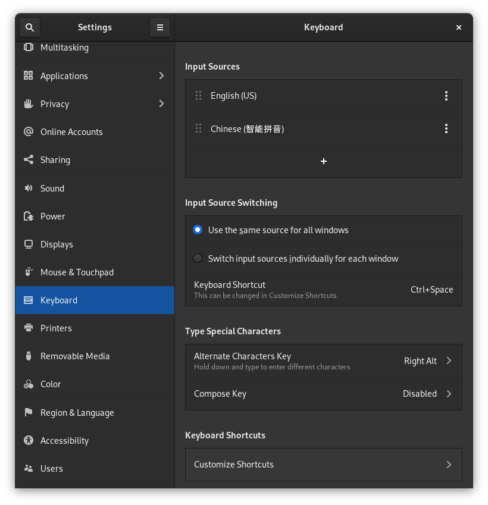
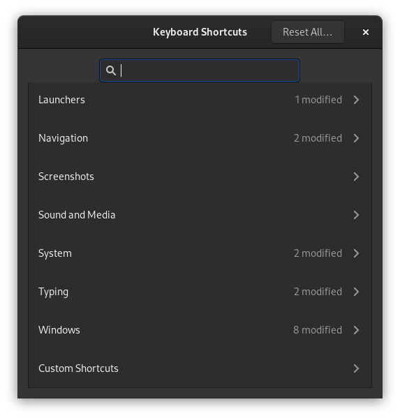
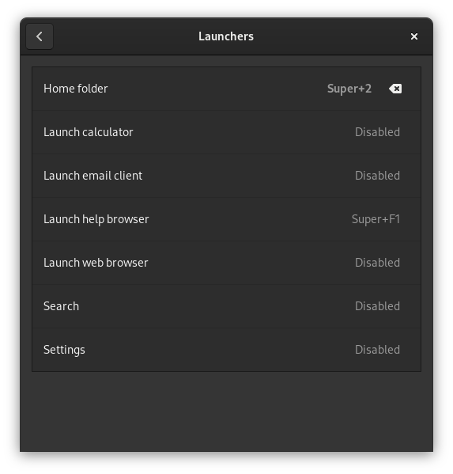
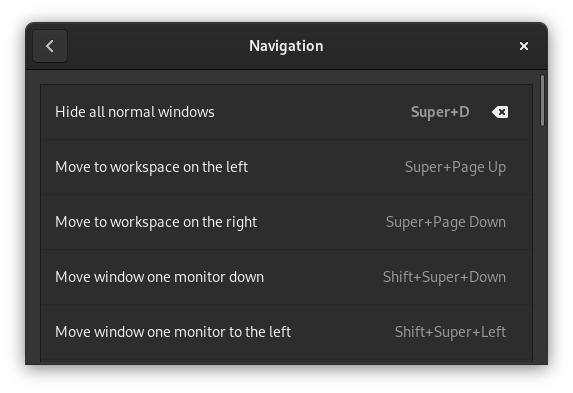
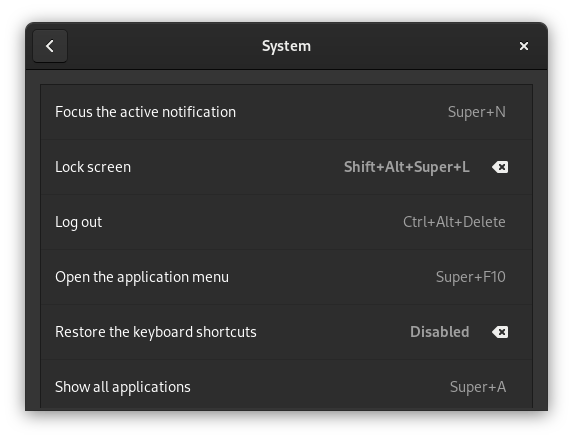
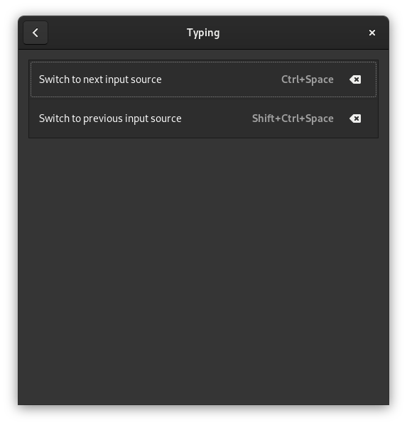
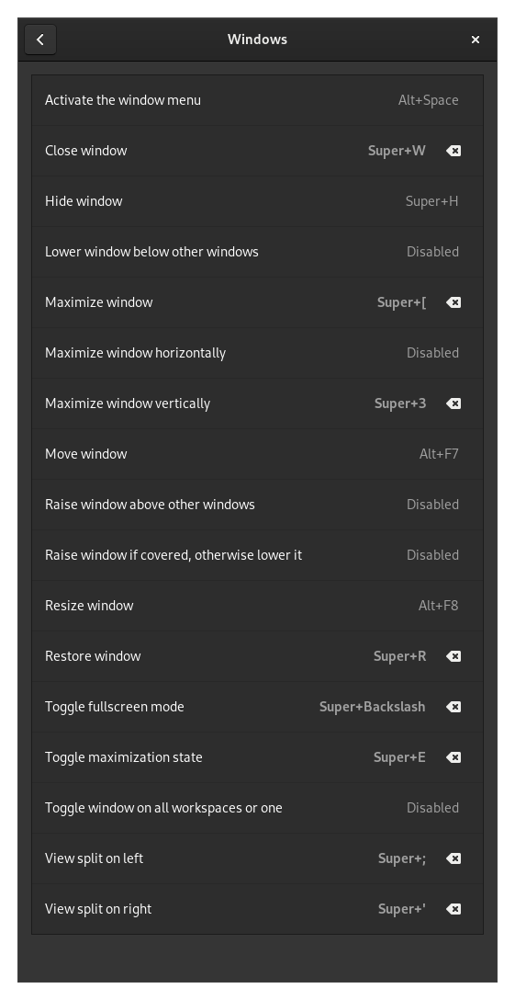
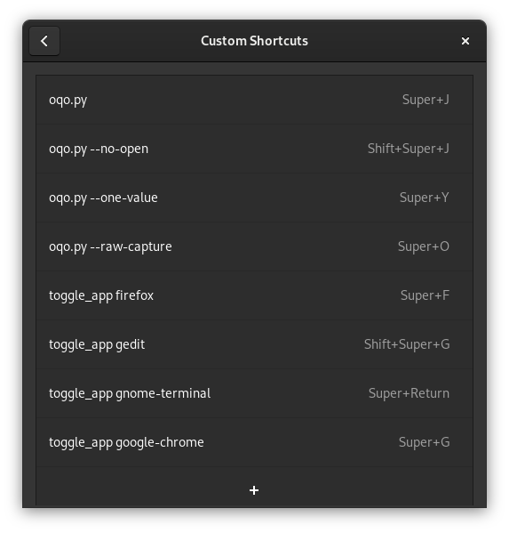

# My OL9 shortcuts

Here are my keyboard shortcuts for my Oracle Linux 9:











## keyd config
```bash
git clone https://github.com/rvaiya/keyd
cd keyd
make && sudo make install
sudo mkdir -p /etc/keyd
sudo systemctl enable keyd
sudo systemctl start keyd

sudo .keyd/bin/keyd -m
sudo vim /etc/keyd/default.conf
  [ids]
  
  *
  
  [main]
  
  # Maps capslock to escape when pressed and control when held.
  #capslock = overload(control, esc)
  capslock = overload(meta, esc)
  #capslock = overload(hyper, esc)
  #space    = overload(leftmeta, space)
  
  # Remaps the escape key to capslock
  #esc = capslock


sudo ./keyd/bin/keyd reload
```
